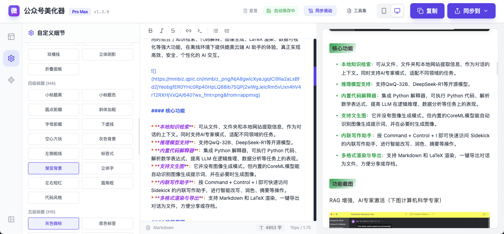
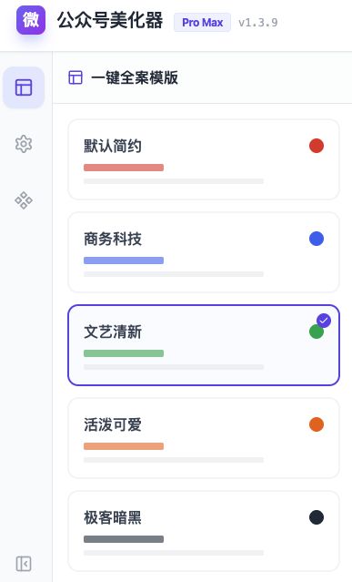
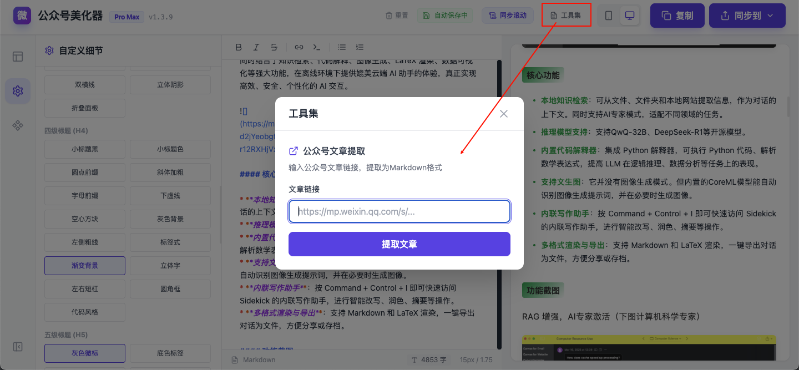
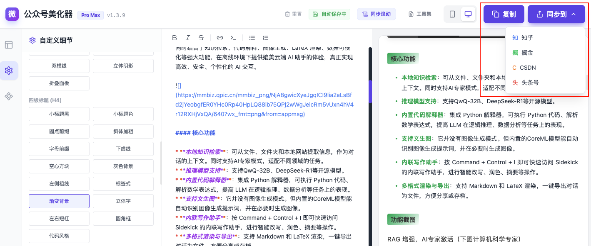

# 微信文章编辑器 Pro Max

一款功能强大的微信公众号文章编辑器，支持Markdown语法、一键美化、多平台同步等功能。


## ✨ 核心功能

### 📝 高级编辑功能
- **Markdown语法支持**：支持完整的Markdown语法，包括标题、列表、链接、图片等
- **实时预览**：左侧编辑，右侧实时预览，所见即所得
- **语法高亮**：编辑区和预览区均支持代码语法高亮
- **快捷键支持**：支持常用快捷键，提升写作效率
- **自动保存**：实时自动保存草稿，永不丢失内容

### 🎨 美化功能

- **一键全案模版**：提供多种预设主题，一键应用整套样式
- **自定义样式**：支持自定义字体、主题色、标题样式等
- **丰富的样式库**：提供8种一级标题样式、6种二级标题样式、5种三级/四级标题样式
- **代码块美化**：支持Mac风格代码块，黑白两种配色
- **引用和分割线**：提供多种引用和分割线样式

### 🛠️ 工具集
- **公众号文章提取**：输入微信公众号文章链接，一键提取为Markdown格式

- **多平台同步**：支持同步到知乎、掘金、CSDN、头条号等平台（当前仅支持跳转到指定平台文章编辑页面）

- **一键复制**：一键复制为微信公众号支持的HTML格式
- **组件插入**：支持插入滑动布局、卡片容器等常用组件

## 🚀 快速开始

### 安装依赖
```bash
npm install
```

### 启动开发服务器
```bash
npm run dev
```

### 构建生产版本
```bash
npm run build
```

## 📖 使用说明

### 基本编辑
1. 在左侧编辑区输入Markdown格式的内容
2. 右侧实时预览渲染效果
3. 使用顶部工具栏进行快速格式化

### 样式美化
1. 点击左侧侧边栏的「一键全案模版」选择预设主题
2. 点击「自定义样式」进行个性化设置
3. 选择不同的标题、引用、代码块样式

### 公众号文章提取
1. 点击顶部「工具集」按钮
2. 输入微信公众号文章链接
3. 点击「提取文章」，提取成功后自动填充到编辑区

### 多平台同步
1. 点击顶部「同步到」按钮
2. 选择目标平台
3. 自动打开平台编辑页面并填充内容

## ⌨️ 快捷键

- **加粗**：Ctrl/Cmd + B
- **斜体**：Ctrl/Cmd + I
- **删除线**：Ctrl/Cmd + D
- **行内代码**：Ctrl/Cmd + E
- **插入链接**：Ctrl/Cmd + K
- **无序列表**：Ctrl/Cmd + Shift + U
- **有序列表**：Ctrl/Cmd + Shift + O
- **保存**：Ctrl/Cmd + S

## 📦 技术栈

- **React 18**：前端框架
- **Vite**：构建工具
- **Tailwind CSS**：样式框架
- **Lucide React**：图标库
- **Markdown-it**：Markdown解析

## 📱 响应式设计

- **桌面端**：双栏布局，编辑和预览同时显示
- **移动端**：单栏布局，支持手势操作

## 🔧 自定义配置

### 主题色配置
支持自定义主题色，可选择预设颜色或自定义颜色值

### 字体配置
支持多种字体选择：
- 系统字体
- 思源黑体
- 微软雅黑
- 宋体
- 楷体

### 排版微调
- 字号：12px - 20px
- 行高：1.4 - 2.2

## 📄 许可证

MIT License

## 🤝 贡献

欢迎提交Issue和Pull Request！

---
**更新时间**：2026年
